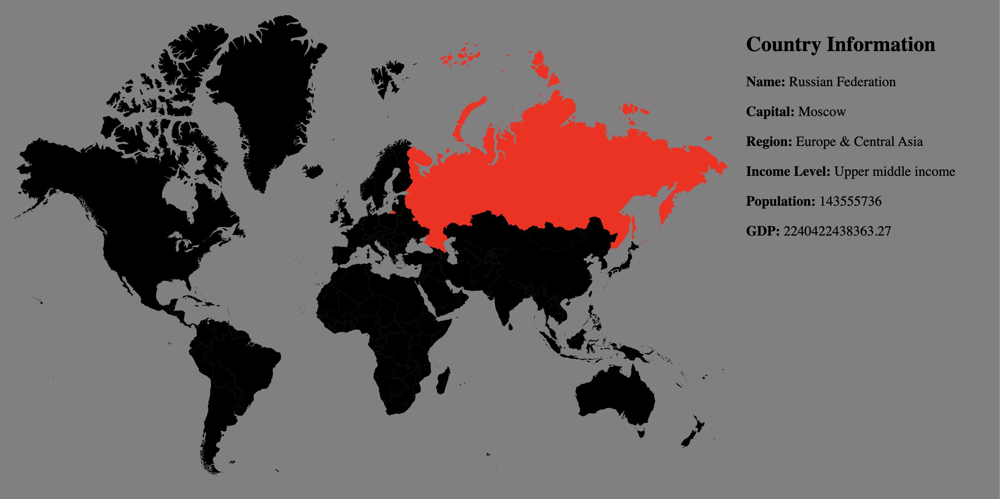

# Interactive World Map 

## Overview
This project presents an interactive world map using Angular, highlighting each country in a scalable vector graphic (SVG) format upon mouse events. The application connects to API services to fetch and display information about each country.

## World Map Picture In Action


## Prerequisites
- Node.js (Download: [Node.js](https://nodejs.org/))
- Angular CLI (Install via `npm install -g @angular/cli`)

## Getting Started

### 1. Clone the Repository
```bash
git clone https://github.com/evericain01/interactive-world-map.git
cd interactive-world-map
```

### 2. Install Dependencies
```bash
npm install
```

### 3. Run the Application
```bash
ng serve -o
```
Navigate to `http://localhost:4200/` in your browser to view the application.
